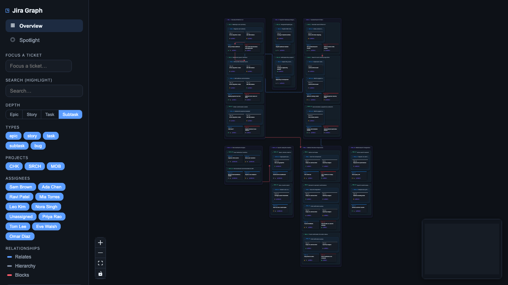
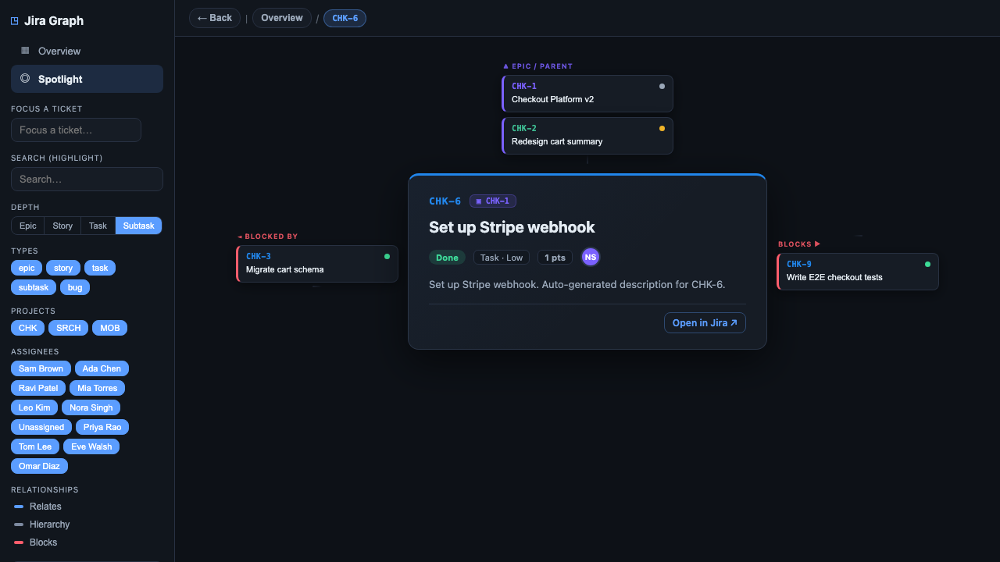
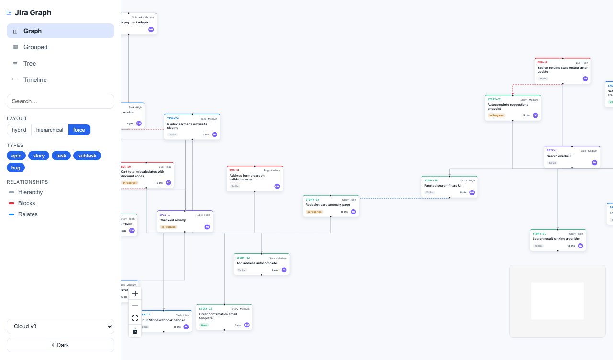

# jira-graph

An interactive Jira relationship visualizer built as a static SPA (Vite + React 19 + TypeScript). It serves a dual purpose: a polished portfolio piece now — fully functional with bundled mock fixtures that exercise v2/v3 API differences — and a plug-in-ready visualization engine for real Jira at work later. Swapping in live data requires only replacing the data provider; the entire visualization layer is untouched.

---

## Screenshots

Overview — grouped board with cross-epic links, dark theme:



Spotlight — one ticket and everything it touches:



Light theme example:



> To regenerate: run the app locally (`npm run dev`), pick a theme/dataset, and take a screenshot.

---

## Features

- **Overview** — all tickets grouped into nested container blocks: **epic ▸ story ▸ task ▸ subtask** (depth selectable 1–4, default full). Each container is collapsible; cross-epic links are drawn ticket-to-ticket. The clearest view for "what's in this epic and how epics connect." Includes a built-in React Flow minimap.
- **Spotlight** — a focus+context view: one ticket centered as the hero, with its relationships laid out in labeled lanes (Epic/Parent, Blocked by, Blocks, Subtasks, Relates to). Click any related ticket to re-center. Breadcrumb trail, Back button, and an Overview shortcut keep navigation fast.
- **Project / assignee filters** — toggle whole projects or individual assignees (incl. Unassigned) on/off from the sidebar; combine with type/status/relationship filters.
- **Type / status / edge filters** — show or hide nodes and edges by issue type, status, and relationship kind.
- **Ticket typeahead** — a "Focus a ticket" typeahead (by key or title) jumps straight to Spotlight for any ticket.
- **Epic badge on cards** — non-epic tickets show a small purple chip with their linked epic's key.
- **Rich ticket nodes** — each node shows the issue key, summary, type icon, status badge, assignee, and epic badge.
- **Visualization only** — no connection handles; you can't accidentally "link" issues by dragging. It renders relationships, it doesn't edit them.
- **Jira v2 / v3 + Epic Link compatibility** — normalizer handles `fields.parent` (Cloud v3) and the legacy "Epic Link" custom field (Server v2), detected at runtime by field name. When Epic Link is absent the epic edges simply disappear — no errors, no broken UI.
- **Light / dark themes** — a CSS-variable theme system with a sidebar toggle (defaults to dark, persisted to `localStorage`). Every surface, including the React Flow chrome, follows the theme.
- **Orthogonal edge routing** — a hand-rolled A\* router treats every ticket/container as an obstacle and draws right-angle paths *around* them: a connecting line never crosses under a ticket.
- **Relationship-colored edges + legend** — edges are colored by relationship (blocks, relates, duplicates, clones, hierarchy) from a single palette; the sidebar legend lists the relationships present and toggles their visibility.
- **Click-a-line popup** — click any edge for a popover showing both tickets, the relationship with direction, plain-English phrasing, and open-in-Jira links.

---

## Design, theming & edge routing

- **Theme system** — `src/theme/tokens.css` defines CSS custom properties under `[data-theme="dark"]` / `[data-theme="light"]`; `src/theme/useTheme.ts` holds the choice (default dark, `localStorage`-persisted, sets `data-theme` on `<html>`). Components reference tokens only, so the toggle reskins the whole app, including React Flow's background/minimap/controls.
- **Sidebar** — `src/components/Sidebar.tsx` is the single control surface.
- **Edge routing** — `src/graph/routing.ts` is a pure, unit-tested orthogonal A\* router: `routeOrthogonal(from, to, obstacles)` returns right-angle waypoints that avoid every obstacle rect (guaranteed: no segment crosses a ticket; falls back to a direct L-path when clear). `src/components/RoutedEdge.tsx` renders it; the canvases supply obstacle rects (containers included) via `RoutingContext`. Zero new dependencies.
- **Relationship palette** — `src/graph/relation-colors.ts` is the single source of truth mapping relationship → theme-aware color + label, feeding both edges and the legend.

Design spec: [`docs/superpowers/specs/2026-06-05-jira-graph-redesign-routing-design.md`](docs/superpowers/specs/2026-06-05-jira-graph-redesign-routing-design.md) · Plan: [`docs/superpowers/plans/2026-06-05-jira-graph-redesign-routing.md`](docs/superpowers/plans/2026-06-05-jira-graph-redesign-routing.md)

---

## Two views

The app has two switchable views, both rendered from the same normalized graph. Switch between them in the sidebar.

- **Overview** — tickets collapse into nested **container blocks** with the full hierarchy: **epic ▸ story ▸ task ▸ subtask** (depth selectable 1–4, default full). Each container is collapsible; cross-container links are drawn ticket-to-ticket. Includes a built-in minimap. The clearest view for "what's in this epic and how epics connect."

  

- **Spotlight** — a focus+context view centered on one ticket. Related tickets appear in labeled lanes: **Epic/Parent, Blocked by, Blocks, Subtasks, Relates to**. Click any related ticket to re-center on it. A breadcrumb trail tracks where you've been; the Back button steps back; the Overview button returns to the full board.

  

Design spec: [`docs/superpowers/specs/2026-06-05-jira-graph-spotlight-redesign-design.md`](docs/superpowers/specs/2026-06-05-jira-graph-spotlight-redesign-design.md) · Plan: [`docs/superpowers/plans/2026-06-05-jira-graph-spotlight-redesign.md`](docs/superpowers/plans/2026-06-05-jira-graph-spotlight-redesign.md)

---

## Architecture

The visualization knows nothing about Jira. It consumes a single normalized `{ nodes, edges }` model; a `DataProvider` seam is the only coupling point.

```
┌────────────────────────────────────────────────┐
│  DataProvider (interface)                       │
│   ├── MockProvider   ← bundled fixtures (now)   │
│   └── JiraProvider  ← live Jira REST (later)    │
│         └── shared normalize()                  │
│               ├── absorbs v2 / v3 differences   │
│               ├── ADF → plain text (adf.ts)     │
│               └── Epic Link feature detection   │
└────────────────────────┬───────────────────────┘
                         │ NormalizedGraph
                         ▼
┌────────────────────────────────────────────────┐
│  Graph layer (knows nothing about Jira)         │
│   ├── depth.ts         — neighborhood expansion │
│   ├── grouping.ts      — containment grouping   │
│   ├── grouped-elements.ts — React Flow compound │
│   ├── spotlight.ts     — spotlight lane model   │
│   └── graphReducer     — all interaction state  │
└────────────────────────┬───────────────────────┘
                         │ React Flow nodes/edges
                         ▼
┌────────────────────────────────────────────────┐
│  React UI (Sidebar, GroupedCanvas (Overview),  │
│            SpotlightView, EdgePopup, TicketNode)│
└────────────────────────────────────────────────┘
```

Design spec: [`docs/superpowers/specs/2026-06-04-jira-graph-design.md`](docs/superpowers/specs/2026-06-04-jira-graph-design.md)  
Implementation plan: [`docs/superpowers/plans/2026-06-04-jira-graph.md`](docs/superpowers/plans/2026-06-04-jira-graph.md)

---

## Dependencies & supply-chain hygiene

### Runtime dependencies

| Package | Exact version | Why it's trusted |
|---|---|---|
| `react` | `19.2.7` | Meta-maintained; the de-facto standard React runtime. Audited weekly download count in the hundreds of millions. |
| `react-dom` | `19.2.7` | Same maintainer and release cadence as `react`; necessary companion. |
| `@xyflow/react` | `12.11.0` | The canonical React Flow v12 library. Transitive tree is essentially the d3 interaction modules (d3-drag, d3-zoom, d3-selection) — small, well-understood, widely audited. |

All layout algorithms, application state management, and graph traversal are **hand-rolled with zero additional runtime dependencies**. This minimal, deliberately-vetted dependency surface is intentional for a security-reviewed work environment.

### Hygiene practices

- **Pinned exact versions + committed lockfile** — `package.json` records exact versions (no `^`/`~` ranges); `package-lock.json` is committed so CI and local installs are byte-for-byte identical.
- **`npm ci --ignore-scripts`** — CI (and recommended local installs) use `npm ci` to respect the lockfile exactly and `--ignore-scripts` to block lifecycle-script execution from transitive dependencies.
- **`npm audit` in CI** — the deploy workflow runs `npm audit --audit-level=high`, so any high/critical advisory fails the build.
- **Vet each dep on add** — before adding any new dependency: review the maintainer, weekly download count, transitive dependency tree, and time since last publish. Prefer hand-rolling small utilities over pulling in a new package.

---

## Run locally

```bash
npm install        # install dependencies from lockfile
npm run dev        # start Vite dev server (http://localhost:5173)
npm test           # run Vitest unit tests (76 tests)
npm run build      # type-check + Vite production build → dist/
```

The build emits `dist/` with relative asset paths (`base: './'`) so it can be served from any subdirectory, including GitHub Pages.

---

## Using real Jira at work

Open [`src/providers/JiraProvider.ts`](src/providers/JiraProvider.ts).

The skeleton provider:

- Shares the same `normalize()` function as `MockProvider` — Jira API shape differences are absorbed there, not in the provider.
- Detects whether the instance exposes an "Epic Link" custom field (older Server/Data Center) by calling `/rest/api/3/field` and scanning field names — no hardcoded custom field IDs. (Pointing at a v2 instance means swapping the version in the field/search paths; the normalizer already handles both shapes.)
- Fetches issues from `/rest/api/3/search/jql`. The current skeleton does a single un-paginated request (`fields=*all`); token-based pagination is marked `TODO(work)` in the file and is the one piece to finish against a live instance.
- Requires a thin auth/CORS proxy to attach credentials and forward requests (out of scope for the public demo).

The data provider is the **only** thing that changes when connecting to a live instance. The entire visualization layer — filters, depth expansion, state machine, React components — is untouched.

---

## Project structure

```
src/
├── core/
│   ├── model.ts              — TypeScript types (NormalizedGraph, TicketNode, TicketEdge, …)
│   ├── normalize.ts          — v2/v3 normalizer: parent field, Epic Link, issue links, ADF
│   ├── adf.ts                — Atlassian Document Format → plain text extractor
│   └── jira-fields.ts        — field-name helpers for Epic Link detection
├── providers/
│   ├── DataProvider.ts       — DataProvider interface
│   ├── MockProvider.ts       — normalizes bundled fixtures (dataset picker: v3/v2/no-epic)
│   └── JiraProvider.ts       — live Jira skeleton (shares normalize(); pagination is TODO)
├── fixtures/
│   ├── v3.ts                 — Cloud v3 sample payload (parent field)
│   └── v2.ts                 — Server v2 sample payload (Epic Link custom field)
├── graph/
│   ├── depth.ts              — BFS neighborhood expansion
│   ├── grouping.ts           — containment grouping by depth (Overview)
│   ├── grouped-elements.ts   — grouping → React Flow compound nodes/edges (Overview)
│   ├── spotlight.ts          — lane model for Spotlight view
│   ├── layouts/
│   │   ├── grouped.ts        — nested container layout (Overview)
│   │   └── types.ts          — layout type definitions
│   └── (*.test.ts files alongside each module)
├── state/
│   └── graphReducer.ts       — useReducer state machine (incl. viewMode/groupDepth/collapsed)
└── components/
    ├── GroupedCanvas.tsx      — React Flow canvas wrapper (Overview)
    ├── SpotlightView.tsx      — focus+context lane view (Spotlight)
    ├── ContainerNode.tsx      — grouped container node
    ├── Sidebar.tsx            — project/assignee filters, legend, search, typeahead, dataset, theme
    ├── TicketNode.tsx         — custom React Flow node (full + compact, epic badge, focal ring)
    ├── TicketTypeahead.tsx    — ticket search typeahead
    ├── RoutedEdge.tsx         — orthogonal routed edge renderer
    ├── routing-context.ts     — React context for obstacle rects
    └── EdgePopup.tsx          — click-a-line relationship popover
```

---

## Testing

The pure-logic core — `normalize` (incl. date fields), depth expansion, grouping, spotlight lane logic, `MockProvider`, `graphReducer`, `grouped-elements`, routing, relation-colors, relationships, and visible-filter — is covered by **76 Vitest unit tests**. Tests run in Node (no browser required) and complete in under a second.

The thin React layer (component rendering, user interactions, visual output) is verified by running the app: `npm run dev` spins up the full SPA against the bundled fixtures, and `npm run build` confirms the production bundle compiles and tree-shakes cleanly.
